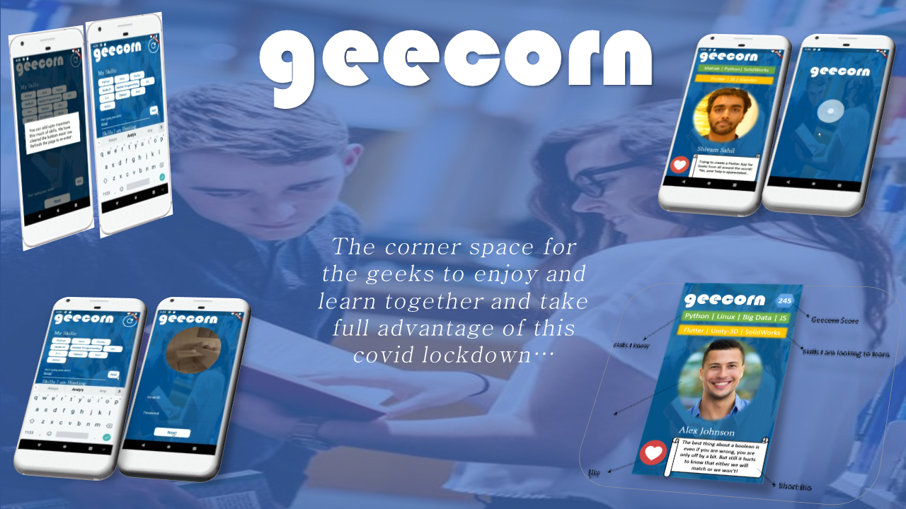
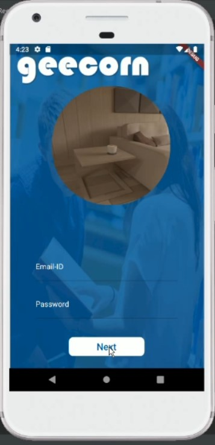
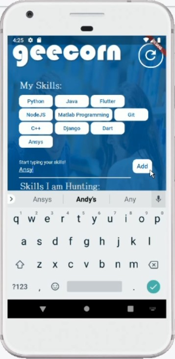
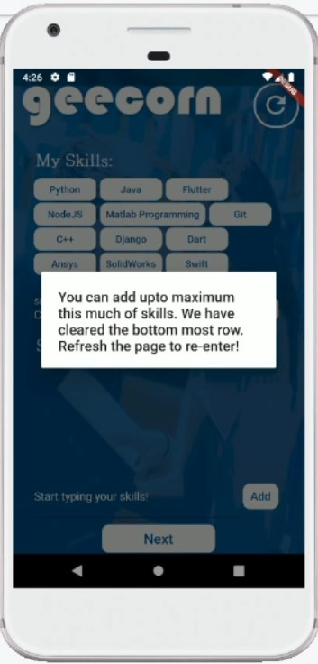

# GeeCorn

[Youtube Link](https://youtu.be/Y4PzMjd71GE)

**A tinder for Geeks to meet and make use of this Lockdown in a productive way.**

Gee-Corn is a Flutter based mobile app which allows geeks all around the world to discover their partners with common interests and accordingly learn a new skill.

## Project Components

1. Flutter
2. Firebase

The project is developed with the help of basic Flutter dependencies and firebase. Currently due to some issues in Firebase storage,
the local storage has been used.

## App ScreenShots
 

 
